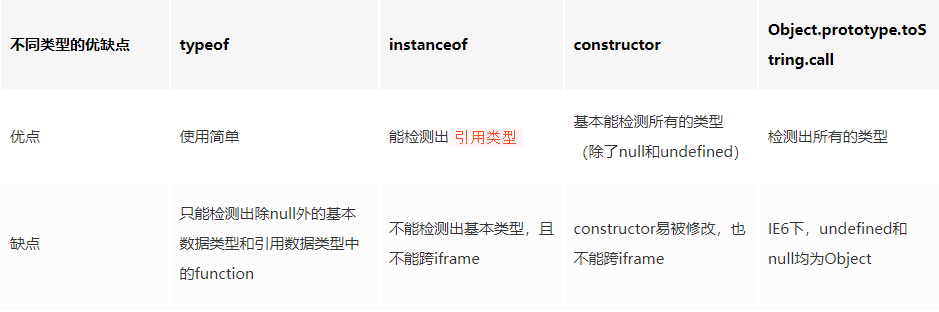

# JavaScript

## 1、JavaScript 中的数据类型

值类型：`Undefined`、`Null`、`Boolean`、`Number`、`String`、`Symbol`、`BigInt`

引用类型：`Object`（包含`Function`、`Array`）

其中`Symbol` 和 `BigInt` 是ES6 中新增的数据类型：
+ `Symbol` 代表<b style="color: #FFCC99;">独一无二且不可变</b>的数据类型，它主要是为了解决可能出现的全局变量冲突的问题。

+ `BigInt` 是数字类型的数据类型，它可以表示任意精度格式的数字。

## 2、检测数据类型的方法



+ typeof 

```javascript
    console.log(typeof 2);               // number
    console.log(typeof true);            // boolean
    console.log(typeof 'str');           // string
    console.log(typeof []);              // object    
    console.log(typeof function(){});    // function
    console.log(typeof {});              // object
    console.log(typeof undefined);       // undefined
    console.log(typeof null);            // object
```

+ instanceof

机制是判断在其**原型链**中能否找到该类型的原型。

```javascript
    console.log(2 instanceof Number);                // false
    console.log(true instanceof Boolean);            // false 
    console.log('str' instanceof String);            // false 
    console.log([] instanceof Array);                // true
    console.log(function(){} instanceof Function);   // true
    console.log({} instanceof Object);               // true
```

+ constructor

```javascript
    console.log((2).constructor === Number); // true
    console.log((true).constructor === Boolean); // true
    console.log(('str').constructor === String); // true
    console.log(([]).constructor === Array); // true
    console.log((function() {}).constructor === Function); // true
    console.log(({}).constructor === Object); // true
```

+ Object.prototype.toString.call()

> 为什么`obj.toString()` 和`Object.prototype.toString.call(obj)` 的结果不一样？

因为`toString` 是`Object` 的原型方法，而`Array`、`Function` 等类型作为`Object` 的实例，都重写了`toString` 方法。（`Function` 类型返回内容为函数体的字符串，`Array` 类型返回元素组成的字符串）

## 3、判断数组的方式有哪些？

1. Object.prototype.toString.call()

```javascript
    Object.prototype.toString.call(obj).slice(8,-1) === 'Array';
```

2. 原型链

```javascript
    obj.__proto__ === Array.prototype;
```

3. ES6的`Array.isArray()`

```javascript
    
```